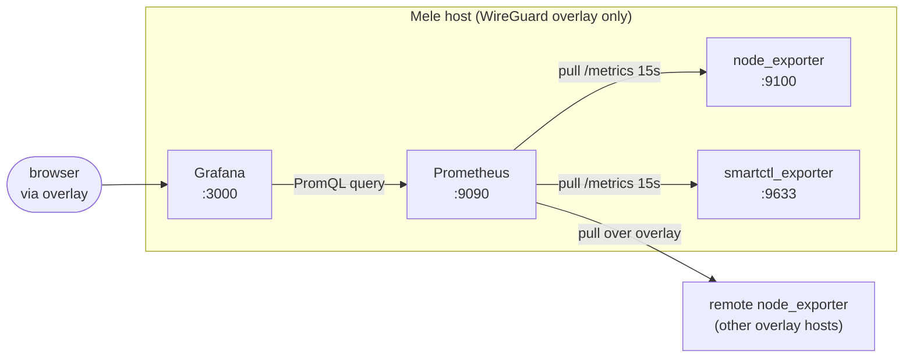

# monitoring-stack

Prometheus + Grafana + node_exporter + smartctl_exporter for host and storage
observability on a small self-hosted homelab. It answers the two questions a NOC or
on-call engineer asks first: *is the box healthy right now?* and *is a disk about to
fail?* Metrics are pulled over a WireGuard overlay; nothing is exposed to LAN or WAN.

**Status: complete** — the compose stack and scrape config are written and deploy cleanly.
Grafana dashboards and screenshots from a running instance are still to be added (the
`grafana/dashboards/` and `docs/screenshots/` directories explain what goes there).

## What it monitors and why

| Layer            | Exporter            | Surfaces                                                                 |
|------------------|---------------------|-------------------------------------------------------------------------|
| Host / OS        | `node_exporter`     | CPU, load, memory, filesystem usage/inodes, network, disk I/O, PSI, uptime |
| Physical storage | `smartctl_exporter` | Per-device SMART: reallocated sectors, media wear, temperature, power-on hours, overall self-assessment |
| Monitoring itself| Prometheus          | Scrape latency, TSDB health, target up/down                             |

Host metrics tell you *the OS is unhappy* (disk 95% full, memory pressure, a NIC
flapping). SMART tells you *the hardware underneath is degrading* before the OS ever
notices — a spinning disk logging reallocated sectors or an SSD past its wear threshold
is still fully readable until the moment it isn't. Those are different failure classes,
which is why both exporters run.

## Stack diagram



## Deploy

```bash
cp .env.example .env
# edit .env: set GRAFANA_ADMIN_PASSWORD, and BIND_ADDR to this host's overlay address
docker compose -f compose/monitoring.yml --env-file .env up -d

# verify
curl -s http://${BIND_ADDR:-127.0.0.1}:9090/-/healthy      # Prometheus
curl -s http://${BIND_ADDR:-127.0.0.1}:3000/api/health     # Grafana
```

Prometheus reads scrape targets from `prometheus/prometheus.yml`. All targets there are
placeholders (`*.example.internal`) — replace them with your own overlay hostnames, which
should stay out of git. Grafana is reachable at `:3000` (default login from `.env`); add
Prometheus as a data source at `http://prometheus:9090`, then import a dashboard from
`grafana/dashboards/`.

## What each exporter surfaces

**node_exporter** exposes kernel/OS counters scraped from `/proc` and `/sys`: per-core
CPU time, load average, memory and swap, filesystem bytes/inodes per mount, disk read/write
latency, network throughput and errors, and pressure-stall information (PSI). It runs with
`pid: host` and read-only binds of `/proc`, `/sys`, and `/` so container isolation stays
intact while it still sees the real host.

**smartctl_exporter** issues raw ATA/NVMe SMART commands to each physical device and
exposes the attributes: reallocated/pending sector counts, SSD media-wearout / percentage
used, drive temperature, power-on hours, and the drive's own pass/fail self-assessment.
This needs privileged device access, so it is scoped tightly: `/dev` mounted read-only and
no port published to the host.

## Decisions and rationale

**Why smartctl_exporter alongside node_exporter, not just node_exporter?**
node_exporter reports the disk as the OS sees it — free space, I/O rates, errors the kernel
surfaced. It is blind to the drive's internal health. A disk can be at 40% used with clean
I/O while its SMART log shows reallocated sectors climbing or an SSD past 90% wear — the
early warning that lets you swap hardware on your schedule instead of during an outage.
smartctl_exporter reads that internal telemetry directly. The two exporters cover
complementary failure domains (OS-visible vs. hardware-internal), so both run.

**Why the Prometheus pull model rather than push?**
Prometheus scrapes each exporter on its own schedule instead of exporters pushing metrics
out. For a self-hosted overlay this is the right fit: exporters need no credentials and no
outbound network access — they just expose `/metrics` on the overlay interface and wait.
The scrape target list is the single source of truth for what is monitored, and a target
that stops responding immediately shows up as `up == 0`, which is itself the liveness
signal. Push would require every exporter to hold the server's address and auth, and a dead
pusher is indistinguishable from a quiet one. Pull keeps secrets and service discovery in
one place (Prometheus) and keeps the exporters dumb and stateless. Short-lived jobs that
can't be scraped would use a Pushgateway, but there are none here.

## Layout

```
monitoring-stack/
├── README.md
├── LICENSE
├── .gitignore
├── .env.example
├── compose/monitoring.yml
├── prometheus/prometheus.yml
├── grafana/dashboards/          # exported dashboard JSON (see README there)
└── docs/screenshots/            # real dashboard screenshots, hostnames scrubbed
```
